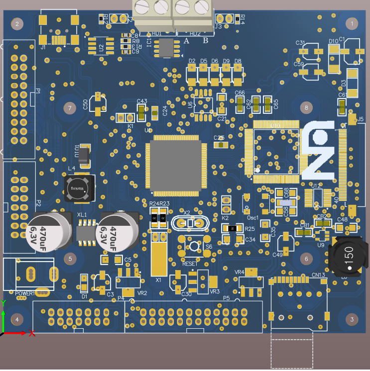

# Porting LVGL to Custom Hardware

## 📌 Description:
- **Ported LVGL** (Light and Versatile Graphics Library) to a **custom STM32-based hardware platform**.
- **Optimized display performance** for real-time applications, ensuring efficient and smooth graphics rendering.
- **Integrated touch input** functionality for interactive user interfaces.
- Utilized **hardware-accelerated graphics rendering** to boost performance and reduce processing overhead.
- Developed a **UI framework** tailored for industrial and automotive applications.
- Integrated multiple **communication protocols**, including:
  - **UART**  
  - **SPI**  
  - **I2C**  
  - **USB**  
  - **CAN**  
  - **RS485**

## ✔️ Technologies Used:
- **STM32** microcontroller platform
- **LVGL** graphics library
- **C++** programming language
- **FreeRTOS** real-time operating system
- **Touchscreen Interface** for user interaction
## 📌 Hardware:

## 🎥 Demo Video  

